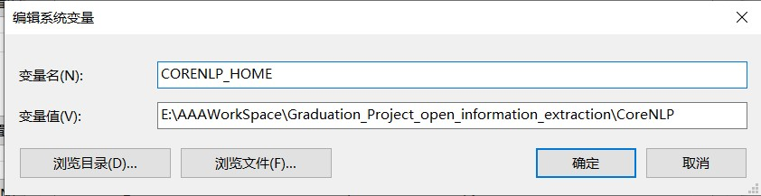

# 开放信息抽取

## 环境配置
1. 克隆该仓库
   ```bash
   git clone https://github.com/Rvlis/Open_Information_Extraction.git
   cd Open_Information_Extraction
   ```

2. 安装包 `pip install -r requirements.txt`
   
3. 安装 __stanza__，stanza支持通过python接口访问JAVA编写的自然语言处理工具 __Stanford CoreNLP__
   ```bash
   git clone https://github.com/Rvlis/stanza.git
   cd stanza
   pip install -e .
   ```

4. 安装 __Stanford CoreNLP__
   ```bash
   cd Open_Information_Extraction
   python
   ```
   ```python
   import stanza
   stanza.install_corenlp("路径值（绝对路径，建议放在Open_Information_Extraction目录下）")
   ```

5. 添加环境变量
   `CORENLP_HOME` = `4.中路径值`
    <div align="center">
      
    </div>

6. 安装 __neuralcoref__ 实现共指消解
   ```bash
   git clone https://github.com/Rvlis/neuralcoref.git
   cd neuralcoref
   pip install -r requirements.txt
   pip install -e .
   ```

7. 安装Spacy预训练模型，下载[该链接](https://github.com/explosion/spacy-models/releases/tag/en_core_web_md-2.3.1)下的 `.tar.gz`文件并安装
   ```bash
   cd Open_Information_Extraction
   pip install en_core_web_md-2.3.1.tar.gz
   ```

## 复合句简化

## 实体抽取

## 关系抽取

## 生成关系三元组

## 性能评估