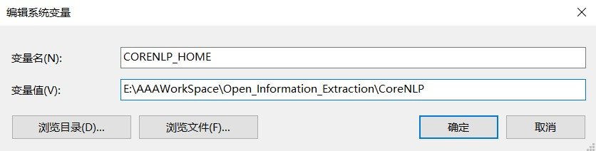
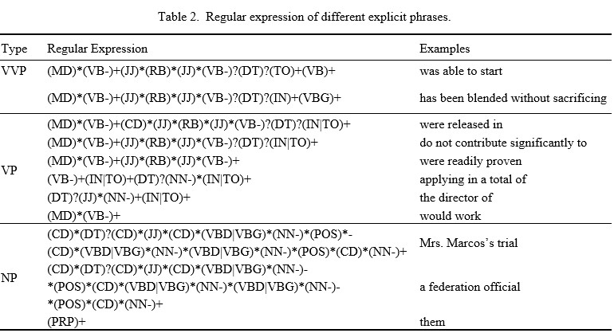

# 开放信息抽取

## 环境要求和配置✔
### 环境要求：
   python-3.6+, Java-1.8, maven-3.0.4
### 环境配置：
1. 克隆该仓库
   ```bash
   git clone https://github.com/Rvlis/Open_Information_Extraction.git
   cd Open_Information_Extraction
   ```

2. 安装包 `pip install -r requirements.txt`
   
3. 安装 __stanza__，stanza支持通过python接口访问JAVA编写的自然语言处理工具 __Stanford CoreNLP__
   ```bash
   git clone https://github.com/Rvlis/stanza.git
   cd stanza
   pip install -e .
   ```

4. 安装 __Stanford CoreNLP__
   ```bash
   cd Open_Information_Extraction
   python
   ```
   ```python
   import stanza
   stanza.install_corenlp("路径值，绝对路径，建议放在Open_Information_Extraction目录下")
   ```

5. 添加环境变量
   `CORENLP_HOME` = `4.中路径值`
    <div align="center">
      
    </div>

6. 安装 __neuralcoref__ 实现共指消解
   ```bash
   git clone https://github.com/Rvlis/neuralcoref.git
   cd neuralcoref
   pip install -r requirements.txt
   pip install -e .
   ```

7. 安装Spacy预训练模型，下载[该链接](https://github.com/explosion/spacy-models/releases/tag/en_core_web_md-2.3.1)下的 `.tar.gz`文件并安装
   ```bash
   cd Open_Information_Extraction
   pip install en_core_web_md-2.3.1.tar.gz
   ```

8. 环境配置完成后，运行demo，对单句进行关系三元组抽取
   ```python
   cd OIE/src
   python run.py
   ```
   得到以下输出结果
   ```python
   >>> Bell, a telecommunication company, which is based in Los Angeles --> (Bell; is based in; Los Angeles)
   >>> Bell, a telecommunication company, which is based in Los Angeles --> (Bell; "is" ; a telecommunication company)
   ```

## 复合句简化
### 要求：
阅读以下参考文献或任何其他参考资料，了解本实验中复合句简化的原理
### 参考文献：
[Context-Preserving Text Simplification](./paper/Context-Preserving-Text-Simplification.pdf)
### 参考代码：
__[OIE/src/C2S_part/](./OIE/src/C2S_part/)__: C2S(Complex To Simple)，复合句简化，基于stanford corenlp工具实现 

## 实体抽取

### 要求：
实验内容的核心部分，要求 __熟练掌握__ 该阶段原理和实现，对于该阶段所设计到的相关知识（包括Tokenize、词性标注POS、依存解析等，以及使用代码过程中遇到的障碍）都要做到熟练掌握

### 参考文献：
[开放信息抽取相关知识介绍](./paper/开放信息抽取相关知识介绍.docx)

### 参考代码：
__[OIE/src/NER_part/corenlp_chunk_candidate_relations_triples.py](./OIE/src/NER_part/corenlp_chunk_candidate_relations_triples.py)__

1. 基于规则的显式短语识别
   
   - 这一步中显式短语的识别方法是通过 __建立关于词性标注（POS tagging，part-of-speech tagging）的正则表达式__

   - 正则表达式代码：19-59
   <div align="center">
      
   </div>


   - 匹配代码：226-278

2. 基于深度学习的显式短语识别
   
   - 这一步中显式短语的识别方法是 __使用自然语言处理工具（例如 Spacy）进行命名实体识别__, 识别出的实体也归类为“显式实体”
   - 匹配代码：283-338

3. 隐式短语扩展（两种扩展规则）

   - __识别名词短语中形容词修饰语的第一规则__：70-120
   - __识别名词短语中核心名词的第二规则__：122-151

## 关系抽取

### 要求：
同上

### 参考代码：
__[OIE/src/NER_part/scenarios.py](./OIE/src/NER_part/scenarios.py)__

1. 关系抽取阶段是通过制定一组结合语言场景与依存解析的规则来过滤掉实体识别阶段中无用的短语，并进一步利用保留的短语生成关系三元组

2. 由于自然语言的特性，同一语义会有多种不同的表达方式，这也进一步导致了自然语言语句的冗长性和结构复杂性。 通过大量的实证研究，我们总结出 __六种__ 常见的、不同的语言场景来处理这一特性，这六种场景 __并非完全独立__，通过 __对这六种场景的不同组合，我们可以对一些结构复杂的长句进行有效的处理__

3. 六种语言场景分别为：
   - __主谓宾结构(含主动时态和被动时态)__: Scenario-1,2 (64-114, 117-149)
   - __主系表结构__: Scenario-8 (337-360)
   - __补足语关系__: Scenario-5 (180-214)
   - __处理出现在VVP短语中的补语成分__: Scenario-5 (180-214)
   - __并列关系__: Scenario-7 (306-335)
   - __同位语关系__: Scenario-6 (218-265)

## 性能评估

1. 下载评测数据集[CaRB](https://github.com/Rvlis/CaRB)到Open_Information_Extraction路径下
   ```bash
   cd Open_Information_Extraction
   git clone https://github.com/Rvlis/CaRB.git
   ```

2. 规范本OIE工具的输入格式以满足评测数据集的要求——Tab seperated, 具体格式为[sentence   probability   predicate   arg1   arg2]， 具体流程为：
   - 批量处理输入句子，参考代码[OIE/src/run.py 批量抽取部分](./OIE/src/run.py)
   - 格式化输出，参考代码[OIE/src/run.py 性能评估部分](./OIE/src/run.py)

3. 性能评估
   ```python
   cd CaRB
   python carb.py --gold=data/gold/dev.tsv --out=dump/OIE.dat --tabbed ../OIE/data/CaRB_output.txt
   ```